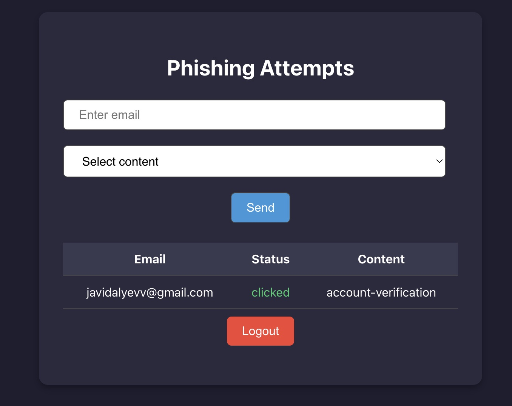
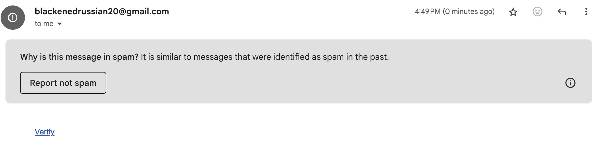

# 🛡️ Phishing Simulation & Management System

This project is a complete phishing awareness training solution, consisting of three main components:

- **`front/`** – Frontend client (authentication, phishing dashboard)
- **`phishing-management-api/`** – Backend service managing users, phishing campaigns, and authentication
- **`phishing-simulator-server/`** – Email phishing simulator and SMTP handler

---

## 📂 Project Structure

```
/
├── front/                     # Frontend application (React)
├── phishing-management-api/  # REST API backend for campaign management
└── phishing-simulator-server/ # Handles sending phishing emails and tracking interactions
```

---

## ⚙️ Environment Configuration

### 1. `phishing-management-api/.env`

```env
NODE_ENV=development
PORT=3000
MONGODB_URI=mongodb://localhost:27018
MONGODB_USER=root
MONGODB_PASSWORD=example
JWT_SECRET=your_super_secure_jwt_secret_key
JWT_EXPIRATION=1d
SIMULATION_SERVICE_URL=http://phishing-simulation-service:4000
CORS_ORIGIN=*
```

### 2. `phishing-simulator-server/.env`

```env
# Application
PORT=3001
NODE_ENV=development
BASE_URL=http://localhost:3001
CORS_ORIGIN=http://localhost:8080

# MongoDB
MONGODB_URI=mongodb://localhost:27018
MONGODB_DB_NAME=phishing-management
MONGODB_USER=root
MONGODB_PASS=example

# Email (SMTP)
SMTP_HOST=smtp.gmail.com
SMTP_PORT=465
SMTP_SECURE=false
SMTP_USER=ilkinnetflix123@gmail.com
SMTP_PASSWORD=tdnncphpwwmihddi
EMAIL_FROM=ilkinnetflix123@gmail.com
```

---

## 🚀 Getting Started

- Make sure Docker Desktop is running.
- Run the following command:

```
docker compose up --build -d
```

- Open your browser and go to:

```
http://localhost:8080
```

---

## 🧪 Usage Flow

- You’ll see the Auth page.
- Register a new account.
- After login, you’ll be redirected to the Phishing Dashboard.
- Enter a real or test email address and choose the type of phishing.
- Click send to trigger the phishing email.
- View the status of all sent phishing emails (also check spam).




---

## 📬 Email Testing

> Use a locally accessible or real email account to view received phishing emails and test interaction tracking.

---

## 📬 Tech Stack

- Nestjs
- MongoDb
- React
- Docker & Docker Compose
